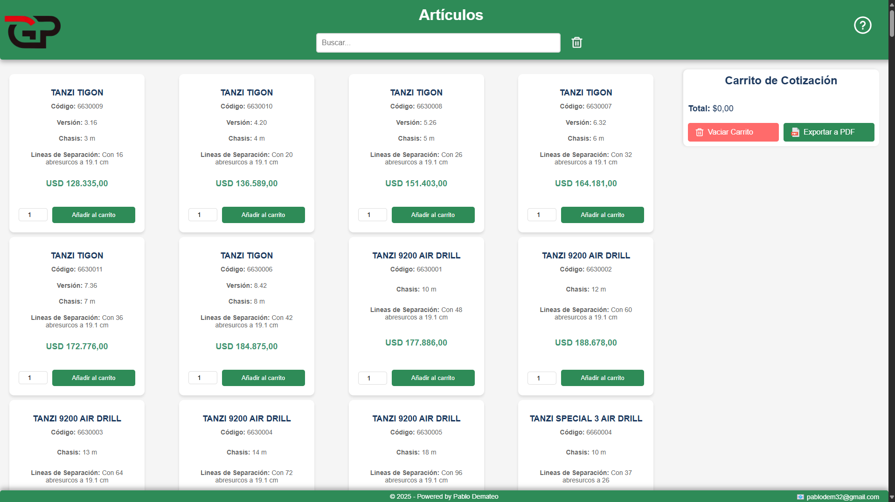
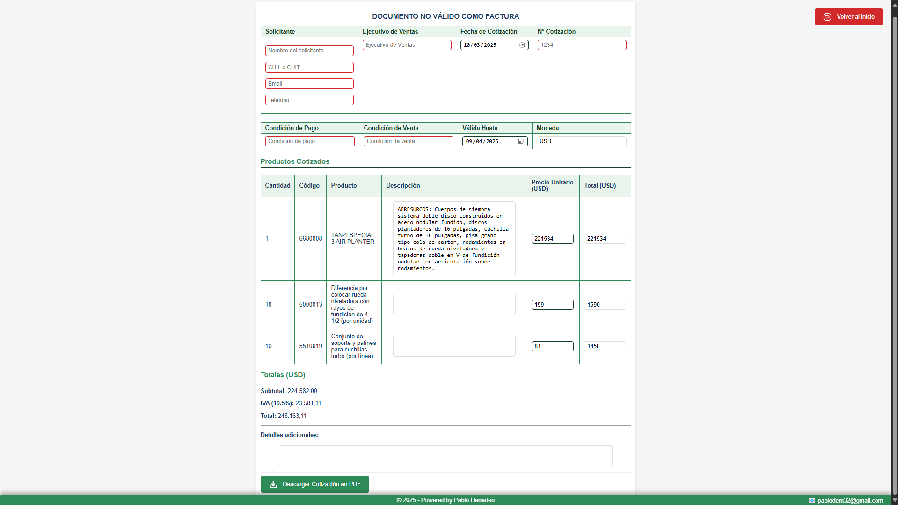

# 🛠️ Cotizador de Maquinarias Agrícolas

🚜 Aplicación web para la generación de cotizaciones interactivas de maquinarias agrícolas. Permite calcular precios dinámicos, gestionar opcionales, calcular impuestos y exportar cotizaciones en PDF con encabezados personalizados.  

## 📌 Características

✅ **Carga dinámica de productos y opcionales** desde un JSON.  
✅ **Cálculo automático de totales** al modificar precios o cantidades.  
✅ **Persistencia de datos en LocalStorage** para uso sin conexión.  
✅ **Exportación a PDF con encabezados y pie de página dinámicos** usando `jsPDF`.  
✅ **Interfaz responsiva y optimizada para dispositivos móviles**.  
✅ **Interacción con el usuario** mediante modales de ayuda y eventos en elementos clave.  

---

## 📸 Capturas de Pantalla

### 🎯 Vista Principal  

### 📄 Generación de PDF  

---

## 🚀 Tecnologías Utilizadas  

🔹 **HTML5, CSS3 y JavaScript**  
🔹 **LocalStorage** para almacenar datos sin conexión  
🔹 **jsPDF** y **autoTable.js** para exportación a PDF  
🔹 **html2canvas** para capturas de pantalla en el PDF  
🔹 **Flexbox y CSS Grid** para el diseño responsivo  
